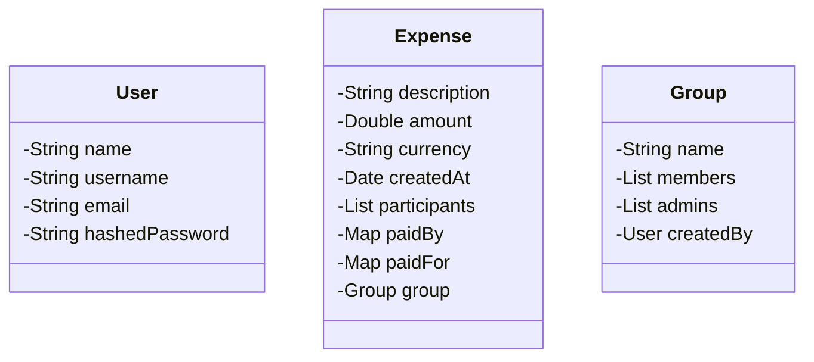
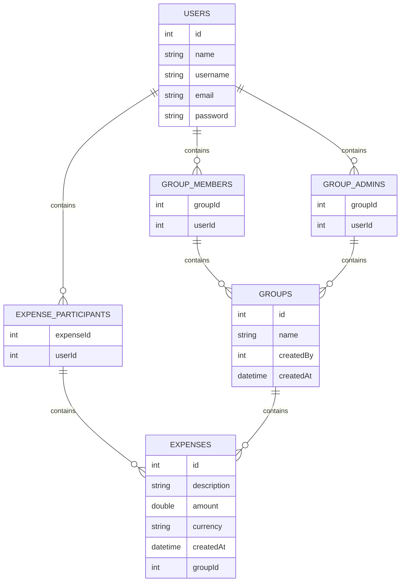

# Design Splitwise

## Class diagrams

```mermaid
classDiagram
    class User {
        -String name
        -String username
        -String email
        -String hashedPassword
    }

    class Expense {
        -String description
        -Double amount
        -String currency
        -Date createdAt
        -List<Participant> participants
        -Map<User, Double> paidBy
        -Map<User, Double> paidFor
        -Group group
    }

    class Group {
        -String name
        -List<User> members
        -List<User> admins
        -User createdBy
    }
```

## Schema design

```mermaid
erDiagram
    USERS {
        int id
        string name
        string username
        string email
        string password
    }

    EXPENSES {
        int id
        string description
        double amount
        string currency
        datetime createdAt
        int groupId
    }

    GROUPS {
        int id
        string name
        int createdBy
        datetime createdAt
    }

    GROUP_MEMBERS {
        int groupId
        int userId
    }

    GROUP_ADMINS {
        int groupId
        int userId
    }

    EXPENSE_PARTICIPANTS {
        int expenseId
        int userId
    }
    

    GROUP_MEMBERS ||--o{ GROUPS : contains
    GROUP_ADMINS ||--o{ GROUPS : contains
    EXPENSE_PARTICIPANTS ||--o{ EXPENSES : contains
    USERS ||--o{ EXPENSE_PARTICIPANTS : contains
    USERS ||--o{ GROUP_MEMBERS : contains
    USERS ||--o{ GROUP_ADMINS : contains
    GROUPS ||--o{ EXPENSES : contains
```